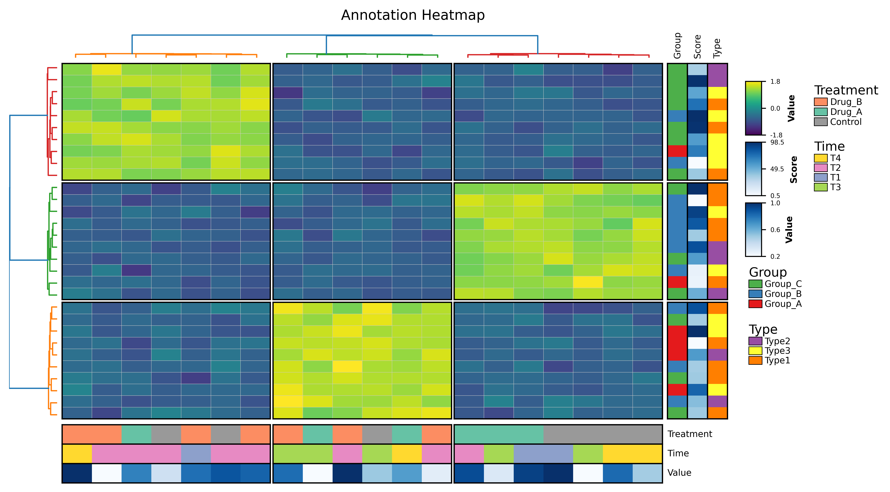

# eheatmap
Effortless heatmap generation in Python: Focus on your data, not the plotting code. It provides extensive control over clustering, annotations, color mapping, and layout, making it ideal for scientific data visualization and publication-ready figures.

The development of this tool was inspired by PyComplexHeatmap and the R package pheatmap. We would like to express our gratitude to all the developers and maintainers of these two projects.

## ✨ Features

* **Hierarchical Clustering**: Support for row and column clustering with various linkage methods (e.g., Ward, Complete) and distance metrics (Euclidean, Correlation).
* **Split & Gap Customization**: Split heatmaps into clusters with customizable gaps and split borders.
* **Comprehensive Annotations**: Add discrete or continuous annotation bars on all four sides (Top, Bottom, Left, Right).
* **Dendrogram Customization**: Adjustable tree height, line width, and color schemes.
* **Data Preprocessing**: Built-in row/column scaling and K-means clustering integration.

